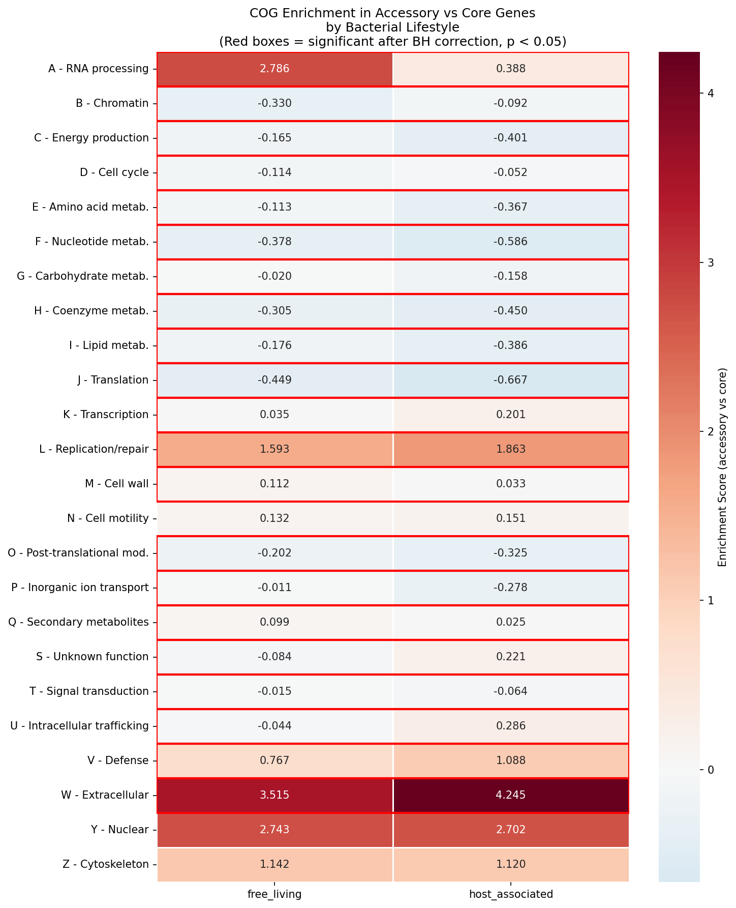
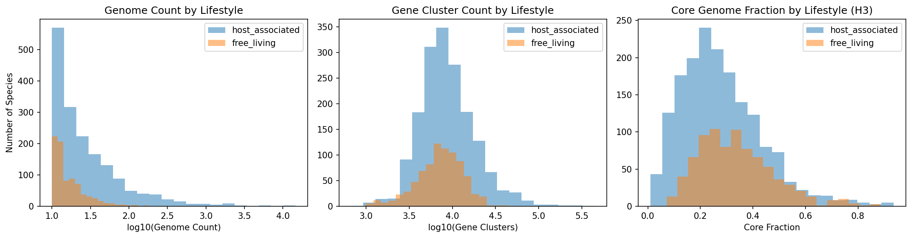
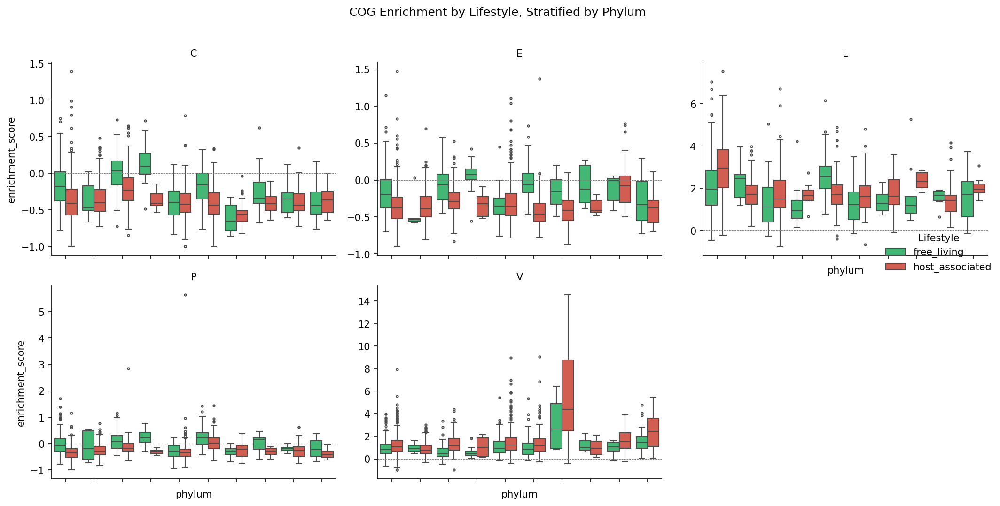

# Report: Lifestyle-Based COG Stratification

## Key Findings

### H1 — Defense gene (COG V) enrichment in accessory genomes is higher in host-associated species (SUPPORTED)

Host-associated species median V accessory-enrichment **1.09** vs free-living **0.77** (diff +0.32; Mann-Whitney p_adj = **2.3 × 10⁻²¹**, BH across 24 categories). Direction holds in 8/10 phyla (80%); within Actinomycetota the host-vs-free diff is +0.74 (p = 1.0 × 10⁻¹⁴) and within Bacillota +0.26 (p = 1.9 × 10⁻⁴).

*(Notebook: 02_cog_enrichment.ipynb, 03_phylogenetic_controls.ipynb)*

### H2 — Metabolic categories (E, G, C, P, I) are more accessory-enriched in free-living species (SUPPORTED)

All five pre-registered metabolic categories show the predicted direction with very strong significance (p_adj < 3 × 10⁻²⁴):

| COG | Description | Host median | Free median | Δ (host − free) | p_adj |
|---|---|---|---|---|---|
| E | Amino acid metabolism | −0.367 | −0.113 | −0.254 | 9.4 × 10⁻⁷⁹ |
| I | Lipid metabolism | −0.386 | −0.176 | −0.211 | 2.2 × 10⁻⁷⁸ |
| P | Inorganic ion transport | −0.278 | −0.011 | −0.267 | 3.1 × 10⁻⁶⁴ |
| C | Energy production | −0.401 | −0.165 | −0.236 | 4.9 × 10⁻⁶² |
| G | Carbohydrate metabolism | −0.158 | −0.020 | −0.138 | 2.4 × 10⁻²⁴ |

Negative scores indicate core-enrichment; less-negative free-living values mean those categories occupy a larger share of the accessory genome in free-living species. Phylum consistency 90% for E, G, P, I; 70% for C. Two additional metabolic categories (F nucleotide, H coenzyme) follow the same pattern with p_adj < 2 × 10⁻³⁹.

### H3 — Host-associated species have smaller core fractions (SUPPORTED)

Median core fraction (no_core / no_gene_clusters): host **0.255** vs free **0.320**, Mann-Whitney p = **1.3 × 10⁻²³** (diff −0.065). Host-associated species also have larger accessory fractions (0.745 vs 0.681 median). The host < free direction holds in 6/8 phyla (75%); strongest in Bacteroidota (Δ = −0.095, p = 1.4 × 10⁻¹¹), Bacillota (Δ = −0.129, p = 3.7 × 10⁻⁴), and Campylobacterota (Δ = −0.153, p = 0.034). Cyanobacteriota is an outlier in the opposite direction (host 0.43 vs free 0.28, n_host = 10), likely reflecting reduced genomes of symbiont/endosymbiont Cyanobacteria.

*(Notebook: 03_phylogenetic_controls.ipynb)*

### Striking unexpected finding — S (function unknown) is the dominant accessory category in host-associated species

The most significant difference across all 24 categories is **S (function unknown)**: host accessory share **23.2%** vs free **16.8%**, diff +0.31 enrichment-score, p_adj = **7.8 × 10⁻¹¹⁷**. Host-associated accessory genomes are disproportionately uncharacterized at the COG level. Proportions sum to 1.0 per species within annotated genes, so the signal is real compositional shift rather than differential annotation coverage.

*(Notebook: 02_cog_enrichment.ipynb)*

### Other significant patterns

- **L (replication, recombination, repair)** more accessory-enriched in host (Δ +0.27, p_adj = 2.9 × 10⁻¹⁵) — consistent with mobile-element / HGT load.
- **K (transcription)** more accessory-enriched in host (Δ +0.17, p_adj = 1.4 × 10⁻⁴⁷) — regulatory complexity in host-associated lineages.
- **U (intracellular trafficking, secretion)** more accessory-enriched in host (Δ +0.33, p_adj = 1.5 × 10⁻³³) — likely secretion-system / pathogenicity-island signal.
- **W (extracellular structures)** more accessory-enriched in host (Δ +0.73, p_adj = 5.6 × 10⁻⁶).
- **A (RNA processing)** strongly enriched in free-living accessory (Δ −2.40, p_adj = 1.6 × 10⁻¹⁴), but coverage is partial (n = 1,606).

Twenty-one of 24 COG categories pass BH-FDR significance. Three non-significant categories (Y nuclear structure, N motility, Z cytoskeleton) are either eukaryote-leaning categories with very limited bacterial coverage or unrelated to the lifestyle axis.

## Results

### Sample composition

| Lifestyle | Species | Phyla |
|---|---|---|
| Host-associated | 1,705 | 10 testable (≥5 species) |
| Free-living | 824 | 10 testable |

Largest phyla in the analysis: Pseudomonadota (859), Bacillota_A (361), Bacteroidota (316), Bacillota (314), Actinomycetota (272), Campylobacterota (53), Cyanobacteriota (49), Spirochaetota (34), Bacillota_C (31), Patescibacteria (31).

### Confounder analysis

Host-associated species have systematically more genomes per species (median 20 vs 14, p = 5.1 × 10⁻³⁵) and slightly more gene clusters (median 8,006 vs 7,481, p = 3.8 × 10⁻⁶). This reflects clinical-isolate over-sampling: pathogens have been sequenced more aggressively, so their pangenomes are more deeply resolved. The genome-count confound *amplifies* host accessory size (more genomes = more discovered accessory genes), which would inflate host accessory-enrichment scores symmetrically across categories. The differential pattern across COG categories (V/L/K/U/S host-favoring, E/G/C/P/I free-favoring) therefore cannot be explained by uniform inflation.

### Phylogenetic robustness

Eleven categories show ≥70% direction-consistency across phyla after stratification: **C, E, G, I, J, K, L, M, P, T, V**. The H1 (V), H2 (E/G/P/I), and H3 (core fraction) findings all clear this threshold, indicating they reflect lifestyle effects beyond phylum membership.

## Interpretation

### Why host-associated bacteria over-accumulate accessory defense, mobile-element, and uncharacterized genes

The V/L/U/S/W pattern is internally consistent with a **dynamic mobilome under host pressure**:

- **V (defense)** rises with constant phage pressure in dense host environments — restriction systems, CRISPR-Cas, abortive infection.
- **L (replication/recombination/repair)** captures the machinery of mobile elements themselves (integrases, transposases, recombinases) that ride into accessory genomes via HGT.
- **U (secretion/trafficking)** picks up type III/IV/VI secretion systems and pathogenicity islands, often on mobile genetic elements.
- **W (extracellular)** captures surface-attached factors (pili, capsules, adhesins) under host-immune evasion pressure.
- **S (function unknown)** rises because the strain-specific accessory genes in clinical isolates are precisely the genes that have *not* been characterized — they're observed in single MAGs / outbreak isolates without orthologs to compare against.

### Why free-living bacteria over-accumulate accessory metabolic genes

The E/G/C/P/I/F/H pattern is a **metabolic-flexibility signature**: free-living species face variable substrate availability and chemical/nutrient environments, so adaptive gain of amino-acid biosynthesis, sugar transport, electron donors/acceptors, ion-uptake systems, and lipid metabolism in the accessory pool is favored. This is the genomic correlate of the "generalist with options" ecological strategy.

### Why the H3 core-fraction direction is opposite the classical streamlining story

Free-living species in this analysis are NOT classical obligate endosymbionts (Buchnera, Carsonella) with sub-Mb genomes — those are filtered out by the ≥10-genome species cutoff. The host-associated category here is dominated by facultative pathogens and gut commensals with **expanded** accessory pools driven by HGT and mobile-element traffic, not classical reductive evolution. The result is a reversed apparent direction compared to the endosymbiont literature (Klasson & Andersson 2004; McCutcheon & Moran 2012): facultative host-associated species have *larger* pangenomes with *smaller* relative core, not smaller pangenomes overall. Cyanobacteriota is an outlier precisely because its host-associated members include reduced endosymbionts.

### Literature Context

- **Dewar et al. (2024)** showed lifestyle drives pangenome *structural* variation (fluidity, openness) across 126 species but did not test functional composition. Our 2,529-species analysis extends their result from structure to function: lifestyle shapes both *how much* accessory gene content varies and *what kind of genes* fill that variable pool.
- **Wang et al. (2024)** *Microorganisms* reported that in the *Bacillus subtilis* group, "accessory genes [were] significantly enriched in COG function V (defense mechanisms)." Our finding generalizes this from a single species group to a pan-bacterial pattern (2,529 species, 10 phyla).
- **Awad et al. (2025)** on Enterobacteriaceae found MDR/AMR genes exclusively in the accessory genome — consistent with our V and L accessory-enrichment in host-associated lineages, which are dominated by Enterobacteriaceae.
- **McInerney et al. (2017)** proposed a core-housekeeping vs accessory-defense functional partition. Our data confirm this universal partition (J, F, H, C are core-favoring; V, L are accessory-favoring in both lifestyles) and add the lifestyle axis on top.
- **Tong et al. (2024)** described "diverse metabolic capabilities encoded in the large accessory genome" of free-living oligotrophic-environment microbes. The E/G/C/P/I accessory-enrichment pattern we observe at pangenome scale is the genomic correlate of that observation.
- **Klasson & Andersson (2004)** and **McCutcheon & Moran (2012)** describe classical reductive evolution in obligate symbionts. Our H3 result clarifies that the "smaller core fraction in host-associated" direction applies to facultative host-associated bacteria, while the small-genome obligate-endosymbiont pattern lives in a different regime (excluded here by the ≥10-genome filter).

### Novel Contribution

This is the first pan-bacterial, lifestyle-stratified test of COG functional composition at the core/accessory level using >2,500 species across 10 phyla. Prior studies either covered structural variation only (Dewar et al. 2024), single species groups (Wang et al. 2024 *Bacillus subtilis*; Awad et al. 2025 Enterobacteriaceae), or specific ecological niches without lifestyle comparison (Tong et al. 2024). The phylogenetically robust finding that **V and metabolic categories partition in opposite directions by lifestyle** has not been reported at this scale.

### Limitations

- **Clinical-isolate over-sampling** in host-associated species (median 20 genomes/species vs 14 in free-living) deepens accessory-gene discovery in host pangenomes. This amplifies host accessory size uniformly but cannot explain the differential COG composition.
- **Function-unknown (S) inflation** in host-associated accessory genomes may partly reflect under-study rather than novel biology. The annotation-lag pattern from `functional_dark_matter` NB12 (83.7% of dark genes are annotation-lag, not truly unknown) likely applies here — many of these S-class accessory genes would re-annotate with bakta v1.12.0.
- **Lifestyle classification** is binary (host_associated / free_living) derived from `ncbi_env` keywords. Facultative organisms, soil-rhizosphere species, and aquatic-host transitional taxa are forced into one bin. The classifier excluded ambiguous cases; absolute counts could shift if more flexible classification rules were used.
- **Phylogenetic confounding** is mitigated by phylum-stratified consistency checks but not formally controlled with PGLS. The 70-90% direction-consistency results indicate the signal is robust to phylum membership, but a formal phylogenetically-controlled GLM at genus or family resolution would strengthen the H1/H2/H3 effect-size estimates.
- **COG categories are coarse**. The same V enrichment could be CRISPR-Cas systems, restriction-modification, or toxin-antitoxin in different lineages. Sub-category resolution (specific KEGG / Pfam / defense-finder annotations) would yield mechanistic precision.
- **Cyanobacteriota H3 reversal** reflects an inherent limitation of the lifestyle classifier for taxa where "host-associated" can mean obligate endosymbionts with reduced genomes vs facultative gut/animal-associated species with expanded ones.

## Data

### Sources

| Collection | Tables Used | Purpose |
|---|---|---|
| `kbase_ke_pangenome` | `ncbi_env`, `genome`, `gene_cluster`, `eggnog_mapper_annotations`, `pangenome`, `gtdb_species_clade` | Lifestyle metadata, core/accessory classification, COG annotations, per-species pangenome statistics, GTDB taxonomy |

### Generated Data

| File | Rows | Description |
|---|---|---|
| `data/species_lifestyle_classification.csv` | 2,530 | Per-species lifestyle assignment with confidence score, pangenome statistics, GTDB taxonomy |
| `data/cog_enrichment_by_lifestyle.csv` | 53,340 | Per-species × COG-category core/accessory proportions and enrichment scores |
| `data/cog_lifestyle_stats.csv` | 24 | Per-COG-category Mann-Whitney U test results comparing host vs free, with BH-adjusted p-values |

## Supporting Evidence

### Notebooks

| Notebook | Purpose |
|---|---|
| `notebooks/01_data_exploration.ipynb` | Query `ncbi_env`, build lifestyle classifier from `host` / `isolation_source` / `env_broad_scale`, aggregate to species level, filter to ≥10 genomes / clear assignment |
| `notebooks/02_cog_enrichment.ipynb` | Per-species core/accessory COG proportions; enrichment scores; Mann-Whitney + BH-FDR across categories |
| `notebooks/03_phylogenetic_controls.ipynb` | Phylum-stratified consistency analysis; confounder comparison (genome count, gene clusters, core fraction); publication figures |

### Figures

| Figure | Description |
|---|---|
| `figures/lifestyle_cog_heatmap.png` | Side-by-side heatmap of median COG enrichment by lifestyle with significance markers |
| `figures/enrichment_heatmap.png` | Per-species enrichment matrix (rows: species, cols: COG categories), clustered by lifestyle |
| `figures/phylum_stratified.png` | Within-phylum host-vs-free comparisons across the 10 testable phyla |
| `figures/core_fraction_comparison.png` | Distribution of core-fraction (no_core / no_gene_clusters) by lifestyle |

## Future Directions

1. **Decompose the V signal** by specific defense-system class (CRISPR-Cas, restriction-modification, toxin-antitoxin, abortive-infection, BREX/DISARM) using `defense-finder` or `padloc` annotations. Test whether the host-vs-free V gap is driven by a single system type or distributed across the defense repertoire.
2. **Decompose the L signal** by mobile-element class (transposons, integrons, conjugative elements, phage integrases) to test the HGT-load hypothesis explicitly.
3. **Resolve the S (function unknown) signal**: re-annotate host-associated accessory S-class genes with bakta v1.12.0 (per `functional_dark_matter` NB12) to quantify how much is annotation-lag vs genuinely novel biology.
4. **Phylogenetically-controlled GLM** at genus or family resolution to formalize the H1/H2/H3 effect sizes beyond the direction-consistency heuristic, following the per-species phylum + log₁₀(genome_size) approach used in `plant_microbiome_ecotypes` H5.
5. **Three-way lifestyle classification** (free-living / commensal / pathogen) for host-associated species, since constant phage pressure (driving V) and pathogen-specific selection (driving U secretion systems) are likely distinct subcategories.
6. **Connect to pangenome openness**: combine with `pangenome_openness` and `openness_functional_composition` projects to test whether the host accessory-V signal is mediated by openness (host species are more open → carry more accessory) or independent.

## References

1. **Dewar AE, Hao C, Belcher LJ, Ghoul M, West SA. (2024).** "Bacterial lifestyle shapes pangenomes." *PNAS*, 121(22), e2320170121. DOI: 10.1073/pnas.2320170121. PMID: 38743630
2. **Wang T, Shi Y, Zheng M, Zheng J. (2024).** "Comparative Genomics Unveils Functional Diversity, Pangenome Openness, and Underlying Biological Drivers among Bacillus subtilis Group." *Microorganisms*, 12(5), 986.
3. **Awad MM, Abdelmoteleb M, et al. (2025).** "Genomic Insights into Enterobacteriaceae: Pan-Genome Analysis and Functional Profiling." Egyptian journals; pan-genome COG / AMR partitioning reference.
4. **McInerney JO, McNally A, O'Connell MJ. (2017).** "Why prokaryotes have pangenomes." *Nature Microbiology*, 2, 17040. DOI: 10.1038/nmicrobiol.2017.40
5. **McCutcheon JP, Moran NA. (2012).** "Extreme genome reduction in symbiotic bacteria." *Nature Reviews Microbiology*, 10, 13–26. DOI: 10.1038/nrmicro2670
6. **Klasson L, Andersson SGE. (2004).** "Evolution of minimal-gene-sets in host-dependent bacteria." *Trends in Microbiology*, 12(1), 37–43. DOI: 10.1016/j.tim.2003.11.006
7. **Tong X, Luo D, Leung MHY, Lee JYY, et al. (2024).** "Diverse and specialized metabolic capabilities of microbes in oligotrophic built environments." *Microbiome*, 12, 224.
8. **Moldovan MA, Gelfand MS. (2018).** "Evidence for selection in abundant accessory gene content." *Molecular Biology and Evolution*. DOI: 10.1093/molbev/msab139
9. **Bobay LM, Ochman H. (2018).** "Structure and Dynamics of Bacterial Populations: Pangenome Ecology." In *The Pangenome* (Springer).
10. **Brockhurst MA, et al. (2019).** "The Ecology and Evolution of Pangenomes." *Current Biology*, 29(20), R1094–R1103. DOI: 10.1016/j.cub.2019.08.012

## Discoveries

- **The accessory-defense (V) vs accessory-metabolism (E/G/C/P/I) lifestyle split is pan-bacterial.** Across 2,529 species in 10 phyla, the V-favored-by-host vs metabolism-favored-by-free pattern holds at 80-90% phylum consistency. Anyone analyzing a multi-species pangenome cohort that mixes lifestyles should expect this confound and either stratify or control for it.
- **"S (function unknown)" is the most lifestyle-discriminating COG category by p-value (p_adj 7.8 × 10⁻¹¹⁷)**, not V or any classical functional category. Future projects that report COG enrichment patterns should not silently drop the S category — it carries the dominant signal for clinical-isolate-heavy cohorts.

## Performance Notes

- The per-species core/accessory × COG count is the heavy step. Notebook 02 runs gene_cluster ⨝ eggnog_mapper_annotations filtered by species in a per-species loop on JupyterHub Spark — this is the recommended pattern for any project needing per-species pangenome × COG aggregation at this scale.
- 53,340 enrichment rows for 2,529 species across 24 COG categories (average ~21 categories per species; some species lack annotations for rare categories like A, B, Y, W).

## Authors

- Justin Reese, Lawrence Berkeley National Laboratory, ORCID 0000-0002-2170-2250
