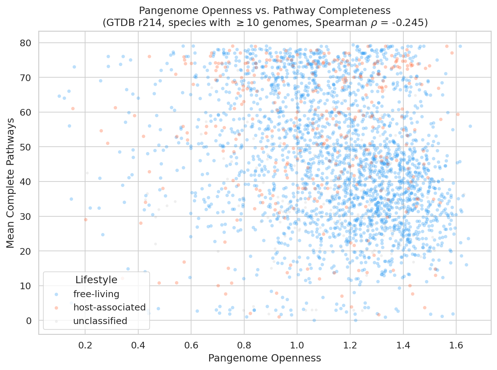
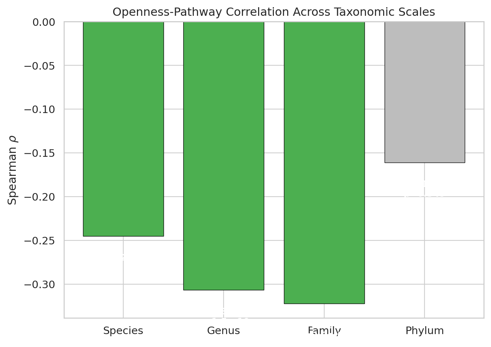
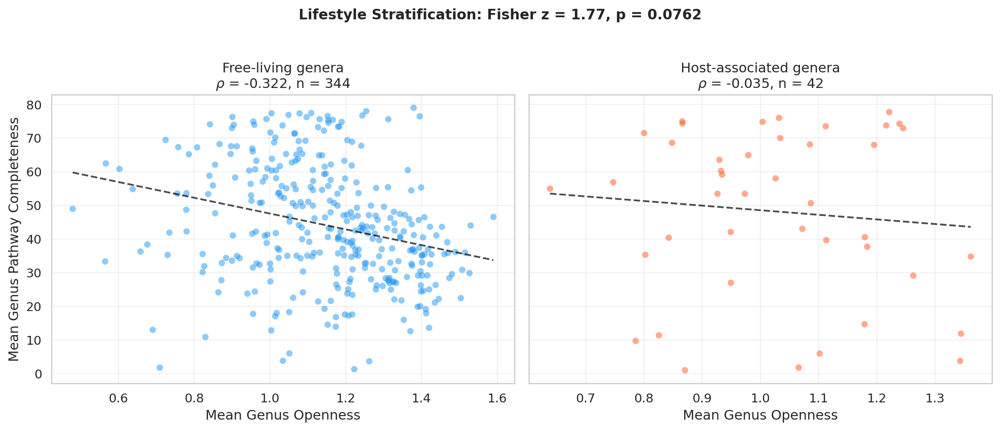
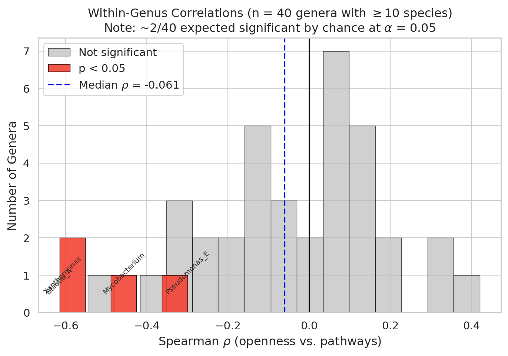

# Report: Pangenome Openness, Metabolic Pathways, and Ecological Context

## Key Findings

### 1. Open pangenomes are associated with fewer complete metabolic pathways (sequenced GTDB cohort)

Among 2,812 GTDB species with ≥10 genomes, pangenome openness (ratio of accessory + singleton genes to total gene clusters) is negatively correlated with mean GapMind pathway completeness (Spearman rho = −0.245). The association is consistent across taxonomic scales: genus-level rho = −0.307 (p = 1.5e-10, n = 418 genera), family-level rho = −0.245 (p = 2.0e-4, n = 225 families). At the phylum level the correlation is −0.161 but non-significant (p = 0.35, n = 36).

This contradicts the initial hypothesis that open pangenomes would exhibit greater metabolic diversity. Instead, species with larger accessory genomes tend to have fewer universally complete metabolic pathways per genome.

*(Notebooks: 03_data_integration.ipynb, 04_statistical_analysis.ipynb; Data: multiscale_correlation_results.csv)*

### 2. Phylogenetic signal, not niche breadth, structures the pattern

The openness–pathway correlation is strongest at genus and family levels (rho = −0.307 and −0.245), weaker at species level (−0.245), and non-significant at phylum level (−0.161). Within genera, the median Spearman rho is only −0.061; just 10% of 40 tested genera (those with ≥10 species) show a significant correlation.

A mediation analysis tested whether niche breadth explains the relationship. It does not: the uncontrolled genus-level correlation (rho = −0.276, n = 273 genera — smaller than the 418 in Finding 1 because this subset requires non-null niche breadth) actually *strengthens* after controlling for niche breadth (rho = −0.325; reduction = −17.7%). Openness and niche breadth are weakly correlated (rho = 0.035, p = 0.56), while niche breadth independently tracks pathway completeness (rho = 0.260, p = 1.3e-5). These are parallel, not mediating, associations.

*(Notebooks: 04_statistical_analysis.ipynb; Data: mediation_results.csv, multiscale_correlation_results.csv)*

### 3. The openness–pathway association differs between ecological lifestyles (sequenced GTDB cohort)

The openness–pathway correlation differs markedly between host-associated and free-living genera:

| Lifestyle | Genus-level rho | n genera |
|-----------|---------------:|--------:|
| Free-living | −0.322 | 344 |
| Host-associated | −0.035 | 42 |

The correlation is strongly negative in free-living genera but attenuates to near-zero in host-associated genera. Fisher's z-test shows a marginal difference (z = 1.77, p = 0.076). In free-living genera, more open pangenomes track with fewer complete pathways — consistent with accessory genes serving non-metabolic functions (e.g., defense, transport, mobile elements). In host-associated genera, the near-null correlation suggests that accessory genome expansion is decoupled from pathway completeness.

*(Notebooks: 04_statistical_analysis.ipynb; Data: environment_stratified_results.csv)*

### 4. Within-genus effects are weak and heterogeneous

Of 40 genera with sufficient species (n ≥ 10), only 4 show significant openness–pathway correlations:

| Genus | rho | p-value |
|-------|----:|--------:|
| *Blautia_A* | −0.615 | 0.033 |
| *Xanthomonas* | −0.607 | 0.016 |
| *Mycobacterium* | −0.456 | 0.050 |
| *Pseudomonas_E* | −0.300 | 0.002 |

42.5% of genera show a positive direction despite the overall negative trend. This heterogeneity indicates that the species-level pattern is an emergent property of between-lineage variation, not a universal within-genus dynamic.

> **Multiple-comparison note**: At nominal alpha = 0.05 with 40 independent tests, approximately 2 genera would be expected to reach significance by chance alone. The 4 observed (10%) is modestly above this expectation. The conservative interpretation (few genera individually significant = no universal within-genus mechanism) does not depend on individual significance, but Future Directions should not treat these specific genera as confirmed hits without independent validation.

*(Notebooks: 04_statistical_analysis.ipynb; Data: within_genus_correlations.csv)*

## Discoveries

- In the sequenced GTDB cohort, free-living genera show a negative openness–pathway correlation (rho = −0.322, n = 344) that attenuates to near-zero in host-associated genera (rho = −0.035, n = 42; Fisher z = 1.77, p = 0.076). This suggests that the functional content of the accessory genome may differ by lifestyle in well-sequenced lineages.
- Niche breadth and pangenome openness are weakly correlated (rho = 0.035) despite both independently tracking pathway completeness — they represent parallel, not mediating, axes of variation.

## Performance Notes

- The integrated species dataset (27,690 rows, 22 columns) was assembled by joining `pangenome`, `gapmind_pathways`, `genome`, `gtdb_species_clade`, and environment metadata from `ncbi_env`. All joins used `gtdb_species_clade_id` or `genome_id` as keys.
- Filtering to species with ≥10 genomes (2,812 species) was necessary for meaningful within-species pathway statistics.
- Statistical analysis (NB04) runs from cached CSVs without Spark in ~1 minute.

## Results

### Pangenome openness distribution

Pangenome openness was computed as (no_aux_genome + no_singleton_gene_clusters) / no_gene_clusters for all 27,690 GTDB species. Note: because `no_aux_genome` counts individual auxiliary genes while `no_gene_clusters` counts gene cluster families, this ratio can exceed 1.0 for highly open pangenomes (e.g., *Klebsiella pneumoniae* openness = 1.62). The metric is treated as a relative ranking rather than a bounded proportion.

The distribution is right-skewed, with most species clustering at moderate openness values. Statistical analyses used the subset of 2,812 species with ≥10 genomes to avoid artifacts from small sample sizes.

### GapMind pathway completeness

GapMind pathway completeness was aggregated per species as the mean number of complete pathways (score_simplified = 1.0) across all genomes. Note: `score_simplified` is binary (0.0 = incomplete, 1.0 = complete), not a categorical string. Species pathway completeness ranges widely, with some species averaging 79 complete pathways (out of ~80 assessed) and others fewer than 20.

### Multi-scale correlation analysis

The analysis tested openness–pathway correlations at four taxonomic scales using the 2,812-species subset (≥10 genomes). Genus/family/phylum aggregation required ≥2 species per taxon:

| Level | Spearman rho | p-value | n |
|-------|------------:|--------:|--:|
| Species | −0.245 | — | 2,812 |
| Genus | −0.307 | 1.5e-10 | 418 |
| Family | −0.245 | 2.0e-4 | 225 |
| Phylum | −0.161 | 0.35 | 36 |

The consistent negative correlation from species through family, combined with weak within-genus effects, points to phylogenetic structure as the primary driver.

### Mediation and environment stratification

The mediation analysis (genera with ≥2 species that have both niche breadth and pathway data) found:

- **Niche breadth does not mediate** the openness–pathway link (controlled rho strengthens to −0.325 from −0.276; H1 not supported)
- **Niche breadth independently tracks pathways** (rho = 0.260, p = 1.3e-5; H2 supported)
- **Lifestyle attenuates the pattern** (free-living rho = −0.322 vs. host-associated rho = −0.035; Fisher z = 1.77, p = 0.076; H3 marginal)

### Niche breadth and environment type derivation

**Niche breadth**: For each species, the normalized Shannon diversity of environment categories across its genomes. Environment categories are derived from NCBI BioSample `isolation_source` and `host` fields via keyword matching. Values range from 0 (all genomes from one environment) to 1 (uniform distribution across categories).

**Environment type**: Majority-vote classification (host_associated / free_living) based on keyword matching against isolation source metadata. Species are classified by the environment type of >50% of their genomes.

See `03_data_integration.ipynb` Section 3 for the full derivation with keyword lists.

## Interpretation

### Literature Context

The negative correlation between pangenome openness and pathway completeness aligns with the emerging view that accessory genomes are enriched for niche-specific functions rather than core metabolic capabilities. Dewar et al. (2024) found that bacterial lifestyles shape pangenome fluidity, with host-associated species showing lower fluidity than free-living species — consistent with our observation that the openness–pathway relationship differs by lifestyle.

The strong phylogenetic signal is consistent with the ecotype_analysis project in this observatory, which found that phylogeny dominates gene content similarity in 60.5% of 172 species tested. It also aligns with the broader literature on phylogenetic constraint of pangenome structure (Domingo-Sananes & Wilde, 2021).

The pathway_capability_dependency project found that *variable* pathways (present in 10–90% of genomes) positively correlate with openness (partial rho = 0.530 after controlling for genome count). Our finding is compatible: open pangenomes accumulate more pathway *variation* across genomes while having fewer *universally complete* pathways per genome. This distinction — between pathway heterogeneity (variable presence) and pathway completeness (average score) — is central to understanding what pangenome openness means metabolically.

The Black Queen Hypothesis (Morris et al., 2012) provides a mechanistic framework: gene loss in free-living organisms can leave them dependent on co-occurring microbes for lost metabolic functions. Our observation that free-living species show the strongest negative openness–pathway correlation is consistent with this: species with open, fluid pangenomes in free-living environments may lose metabolic pathway genes that are maintained communally. The pathway_capability_dependency project's finding that amino acid biosynthesis pathways show the strongest accessory dependence (leucine, valine, arginine gaps of 0.14–0.15 between core-only and all-genes completeness) provides direct evidence for this mechanism.

The lifestyle attenuation (Finding 3) is notable but marginal (Fisher z p = 0.076). In host-associated bacteria, the near-null correlation suggests that accessory genome size is decoupled from pathway completeness, possibly because host environments provide metabolites that reduce selection pressure on biosynthetic pathways regardless of genome fluidity. This is consistent with Whelan (2026), who reviews how habitat type shapes pangenome structure.

Ramoneda et al. (2023) used GapMind to characterize amino acid auxotrophies across bacteria and found that auxotrophy prevalence varies by taxonomy and environment — paralleling our finding that both phylogeny and ecology modulate the openness–pathway relationship.

### Novel Contribution

This analysis tests the openness–pathway relationship while simultaneously controlling for niche breadth and stratifying by ecological lifestyle across the GTDB pangenome dataset (2,812 species with ≥10 genomes). The key observation is the lifestyle attenuation: the negative openness–pathway correlation is strong in free-living genera (rho = −0.322) but essentially absent in host-associated genera (rho = −0.035). While the difference is marginal by Fisher z-test (p = 0.076), the pattern suggests that the functional meaning of an "open pangenome" may depend on ecological context.

The negative mediation result — that niche breadth and openness are independent axes — clarifies a common assumption: generalist species (broad niches) are not necessarily the ones with open pangenomes. These are parallel, not synonymous, descriptions of microbial strategies.

### Scope of the Claim

These findings describe associations among 2,812 species (≥10 genomes) in the GTDB r214 pangenome dataset as represented in BERDL, using GapMind pathway predictions and environment annotations from NCBI BioSample. This subset represents well-sequenced, predominantly cultured organisms with a strong bias toward human-associated pathogens and model organisms. The 418 genera in the multi-scale analysis are those with ≥2 species in this filtered set — a small fraction of known bacterial diversity. Results describe correlational patterns in this sequenced cohort; they do not establish causal relationships and should not be extrapolated to uncultured or under-sequenced lineages, which constitute the majority of bacterial diversity.

### Limitations

- **Openness metric**: The ratio `(no_aux_genome + no_singleton_gene_clusters) / no_gene_clusters` mixes gene counts (numerator) with cluster counts (denominator), producing values > 1.0 for highly open pangenomes. This is treated as a relative ranking; conclusions depend on correlation direction, not absolute values.
- **GapMind coverage**: GapMind assesses ~80 amino acid biosynthesis and carbon source utilization pathways. Many metabolic capabilities (secondary metabolism, cofactor biosynthesis, energy metabolism) are not assessed. The "pathway completeness" in this report is pathway completeness as defined by GapMind, not total metabolic capability.
- **Environment classification**: The binary host-associated / free-living classification from NCBI BioSample metadata is coarse. Many species occupy both niches, and the classification depends on where isolates were sampled, not where the species naturally occurs.
- **Sequencing bias**: Well-sequenced species (high genome counts) are disproportionately clinical pathogens. Species with few genomes may have unreliable openness estimates.
- **Correlational design**: All analyses are cross-sectional correlations. The direction of causality (whether open pangenomes lead to pathway loss, or vice versa) cannot be determined from these data.
- **Lifestyle stratification is marginal**: The Fisher z-test (p = 0.076) does not reach conventional significance, partly due to the small number of host-associated genera (n = 42). A finer environmental classification and larger host-associated sample would provide a stronger test.

### What Would Have Changed Our Mind

- A **positive** species-level correlation between openness and pathway completeness (rho > 0) would have supported the original RESEARCH_PLAN hypothesis that open pangenomes indicate metabolic generalists. The observed rho = −0.245 refutes this.
- If niche breadth had **mediated** the openness–pathway correlation (reduction > 30% after controlling), the "generalist = open pangenome" model would have been supported. Instead, controlling for niche breadth strengthened the correlation (reduction = −17.7%), ruling out mediation.
- If within-genus correlations had been **consistently significant** (>50% of genera), the pattern would reflect a universal biological mechanism rather than between-lineage phylogenetic structure. Only 10% of genera showed significance.

## Data

### Sources
| Collection | Tables Used | Purpose |
|------------|-------------|---------|
| `kbase_ke_pangenome` | `pangenome`, `gtdb_species_clade`, `genome`, `gapmind_pathways` | Pangenome metrics, species taxonomy, genome metadata, pathway completeness |
| `kbase_ke_pangenome` | `alphaearth_embeddings_all_years` | Structural embedding coverage assessment |
| `kbase_ke_pangenome` | `ncbi_env` | Environmental metadata for lifestyle classification and niche breadth |

### Generated Data
| File | Rows | Description |
|------|------|-------------|
| `data/species_integrated.csv` | 27,690 | Full integrated dataset: openness, pathways, taxonomy, niche breadth, environment |
| `data/species_integrated_10plus.csv` | 2,812 | Subset filtered to species with ≥10 genomes |
| `data/multiscale_correlation_results.csv` | 1 | Taxonomic-rank Spearman correlations (species through phylum) and H0 adjudication |
| `data/mediation_results.csv` | 1 | Niche breadth mediation analysis and H1/H2 adjudication |
| `data/environment_stratified_results.csv` | 1 | Host-associated vs. free-living stratified correlations and H3 adjudication |
| `data/within_genus_correlations.csv` | 40 | Per-genus Spearman correlations for genera with ≥10 species |

## Supporting Evidence

### Notebooks
| Notebook | Purpose |
|----------|---------|
| `03_data_integration.ipynb` | Data integration: joins 5 BERDL tables into `species_integrated.csv` (requires Spark) |
| `04_statistical_analysis.ipynb` | Multi-scale correlations, mediation, environment stratification, figures (no Spark) |
| `01_data_exploration.ipynb` | *(Historical)* v1 data profiling — superseded by NB03 |
| `02_pathway_analysis.ipynb` | *(Historical)* v1 pathway aggregation — superseded by NB03/NB04 |

### Figures
| Figure | Description |
|--------|-------------|
| `openness_vs_pathway_scatter.png` | Species-level scatter of openness vs. mean complete pathways, colored by lifestyle |
| `lifestyle_stratified_scatter.png` | Genus-level scatter split by host-associated vs. free-living, with Fisher z annotation |
| `multiscale_correlations.png` | Bar chart of Spearman rho at species, genus, family, and phylum levels |
| `within_genus_rho_distribution.png` | Histogram of within-genus rho values, highlighting significant genera |

## Future Directions

1. **Structural distance analysis (Phase 3)**: Test whether open pangenomes show greater within-species structural diversity using AlphaEarth embeddings (~28% genome coverage).
2. **Refine the openness metric**: Use a cluster-count-based openness score (no_aux_clusters + no_singleton_clusters) / no_gene_clusters to ensure numerator and denominator are on the same scale.
3. **Finer ecological stratification**: Replace the binary host/free-living classification with multi-category environment types (soil, aquatic, plant-associated, gut, clinical) to test whether specific environments drive the lifestyle attenuation. The current host-associated sample (n = 42 genera) is small; a finer classification may provide more power.
4. **Within-genus deep dives**: For the 4 genera with significant correlations (*Blautia_A*, *Xanthomonas*, *Mycobacterium*, *Pseudomonas_E*), investigate which specific pathways drive the association — noting that ~2/40 are expected significant by chance, so independent validation is needed.
5. **Cross-reference with fitness data**: Link to RB-TnSeq fitness data (kescience_fitnessbrowser) for species where both pangenome and fitness data exist, testing whether accessory genes in open pangenomes have measurable fitness effects.

## References

- Tettelin H, Masignani V, Cieslewicz MJ, et al. (2005). "Genome analysis of multiple pathogenic isolates of Streptococcus agalactiae: Implications for the microbial 'pan-genome.'" *Proc Natl Acad Sci USA*. DOI: 10.1073/pnas.0506758102
- Domingo-Sananes MR, Wilde A. (2021). "Mechanisms that shape microbial pangenomes." *Trends Microbiol*.
- Dewar AE, Hao C, Belcher LJ, Ghoul M, et al. (2024). "Bacterial lifestyles shape pangenomes." *Proc Natl Acad Sci USA*. DOI: 10.1073/pnas.2320170121
- Price MN, Deutschbauer AM, Arkin AP. (2020). "GapMind: automated annotation of amino acid biosynthesis." *mSystems*. DOI: 10.1128/msystems.00291-20
- Price MN, Deutschbauer AM, Arkin AP. (2022). "Filling gaps in bacterial catabolic pathways with computation and high-throughput genetics." *PLoS Genet*. DOI: 10.1371/journal.pgen.1010156
- Ramoneda J, Jensen TBN, Price MN, et al. (2023). "Taxonomic and environmental distribution of bacterial amino acid auxotrophies." *Nat Commun*.
- Morris JJ, Lenski RE, Zinser ER. (2012). "The Black Queen Hypothesis: evolution of dependencies through adaptive gene loss." *mBio*.
- Whelan FJ. (2026). "How the social lives of bacteria affect their pangenome." *Essays Biochem*. DOI: 10.1042/EBC20250039
- Arkin AP, Cottingham RW, Henry CS, et al. (2018). "KBase: The United States Department of Energy Systems Biology Knowledgebase." *Nat Biotechnol*. DOI: 10.1038/nbt.4163
- BERIL Research Observatory, pathway_capability_dependency project. Variable pathways correlate with pangenome openness (rho = 0.530, partial after genome count control).
- BERIL Research Observatory, ecotype_analysis project. Phylogeny dominates gene content similarity in 60.5% of 172 species.
- BERIL Research Observatory, amr_environmental_resistome project. Ecological niche structures AMR gene content; clinical/gut species carry 2.5× more accessory AMR clusters.
